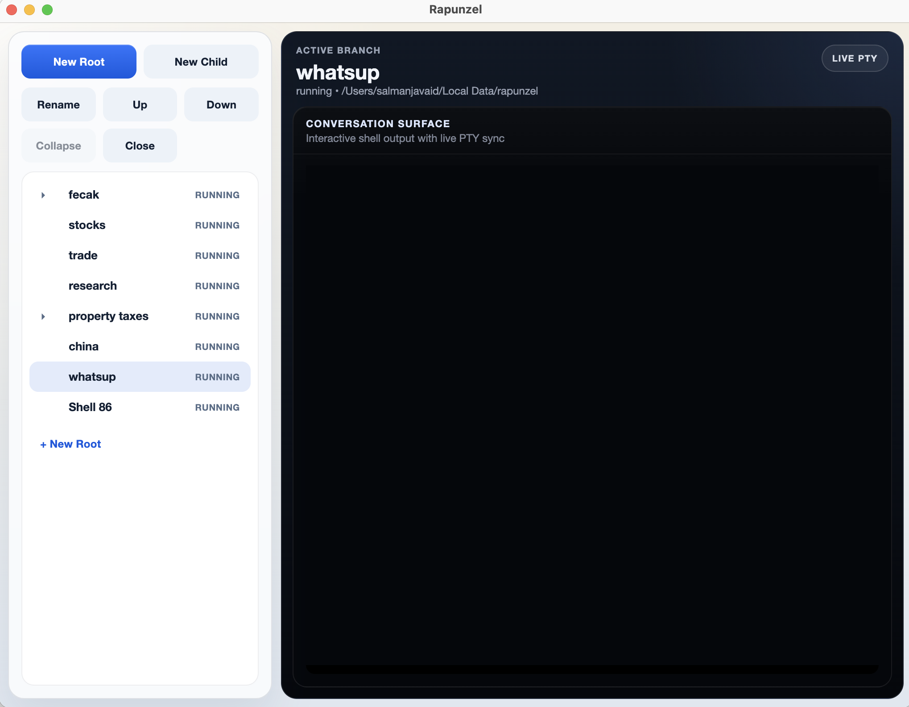

<p align="center">
  
</p>

# Rapunzel

Rapunzel is a browser but for agents.

I built rapunzel because terminal tabs stop scaling once many agents are running across sessions and they become difficult to track. I built it because I love the Tree Style Tab Extension in Firefox. I built it because, it is the time for Chrome, but for agents. I made it, to make it as simple as possible and nothing more.

<p align="center">
  
</p>

## Install

Prerequisites:

- Python 3
- Node.js and npm

From a fresh clone on macOS or Linux:

```bash
git clone <repo-url>
cd rapunzel
./install.sh
```

From a fresh clone on Windows PowerShell:

```powershell
git clone <repo-url>
cd rapunzel
.\install.ps1
```

The install script creates a local virtual environment, installs the Python dependencies, installs the frontend dependencies, and builds the embedded web UI.

## Launch

For normal use:

```bash
./Rapunzel.command
```

On Windows PowerShell:

```powershell
.\Rapunzel.ps1
```

On macOS, you can also double-click `Rapunzel.command` in Finder.

For development:

```bash
source .venv/bin/activate
python3 app.py
```

`Rapunzel.command` prefers the repo-local virtual environment when it exists, so the launch path stays stable after install.

## Why It Exists

- terminal tabs stop scaling once you have many long-running agent sessions
- hierarchical navigation is easier to reason about than a flat tab strip
- the goal is a simple desktop surface for agent work, not a giant IDE

## What It Does

- tree-based shell sessions with root and child branches
- one active live terminal conversation surface
- rename, move, collapse, and close branch actions
- PTY-backed interactive shells
- workspace persistence to `~/.rapunzel/workspace.json`
- restore of the saved workspace tree on launch

## Build macOS App

If you want a clickable app bundle instead of running from source:

```bash
source .venv/bin/activate
pip install pyinstaller
bash build_macos_app.sh
```

Output:

- `dist/Rapunzel.app`

After the build finishes, open `dist/Rapunzel.app` from Finder or double-click it directly.

## Notes

- the primary product path is the embedded `pywebview` desktop app
- shell sessions use the POSIX PTY backend on macOS/Linux and `pywinpty` on Windows
- the older Tk UI still exists as fallback code, but it is no longer the main architecture
- on Apple Silicon Macs, Rapunzel shell sessions wrap `brew` so Homebrew commands are forwarded through native `arm64`

## Repo Layout

- `app.py`: entrypoint
- `install.sh`: first-run setup from source on macOS/Linux
- `install.ps1`: first-run setup from source on Windows
- `Rapunzel.command`: source launcher for normal desktop use on macOS/Linux
- `Rapunzel.ps1`: source launcher for normal desktop use on Windows
- `rapunzel/`: app state, PTY runtime, window host, and fallback UI
- `webui/`: embedded frontend assets for the tree and terminal
- `PROJECT_STATUS.md`: implementation status and next work
- `ARCHITECTURE_AND_PROGRESS.md`: architecture and debugging history
- `FEATURE_TRACKER.md`: running feature log
